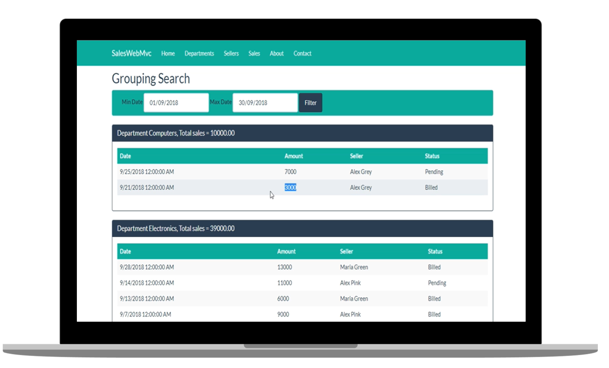

<h1 align="center">
  SALES WEB
</h1>

   
  
  
  

  

  

## ◾ Projeto

O SalesWeb é um sistema de Vendas Online desenvolvido em ASP.NET Core, ele é um CRUD Completo. Este projeto foi elaborado para um aprofundamento nos conhecimentos do framework.

## ◾ Tecnologias

Esse projeto foi desenvolvido com as seguintes tecnologias:

- [ASP.NET CORE](https://docs.microsoft.com/pt-br/aspnet/core/?view=aspnetcore-3.1)
- [BOOTSTRAP 4](https://getbootstrap.com/)
- [MYSQL](https://dev.mysql.com/doc/)
- [C#](https://docs.microsoft.com/pt-br/dotnet/csharp/)

## ◾ Licença

Esse projeto está sob a licença MIT.
